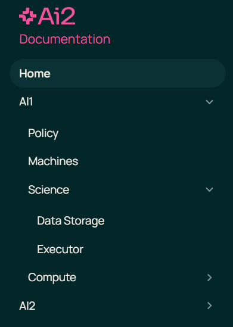

# Beaker Docs - Allen Institute

This repo is for Allen-Institute-Specific docs content about using Beaker in the AI Hub.

Docs in this repo are read by [beaker-docs-build](https://github.com/AllenOCTO/beaker-docs-build/actions) repo on deploy, making this repo content-only.

Documents in this repo will end up located inside a top-level collapsible item in the sidebar of beaker docs application. Take this sidebar image for reference:



## Adding Documents

All documents have to be within `docs/` folder in markdown format (`.md`).

Each document will generate an item in the sidebar.

Documents should have the following format:

```
---
title: Some Title
sidebar_position: 0
---

# Markdown content goes here
```

This is called `front-matter`

* `title`: Sets sidebar item text and browser tab title.
* `sidebar_position`: zero-based index to control documents order in sidebar

Learn more about Docusarus front-matter [here](https://docusaurus.io/docs/create-doc#doc-front-matter).

## Adding Folders

Folders will create a collapsible item rather than a link item, containing all its documents within the collapsible item.

To change the folder's collapsible item text and position in the sidebar, a `_category_.json` file should be added within the folder as below:

```json
{
  "label": "Text to display in sidebar",
  "position": 0
}
```

Within a folder, each document's `sidebar_position` is relative to that folder, so it starts at 0 again and won't generate any conflicts with outer items.